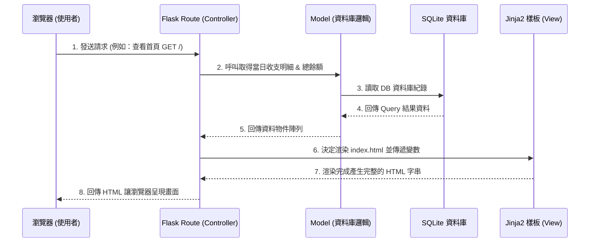

# 系統架構設計 (System Architecture) - 個人記帳簿

本文件描述個人記帳簿應用程式的系統架構，包含技術選型、資料夾結構分層以及各元件的互動關係，主要提供開發團隊作為實作基礎。

---

## 1. 技術架構說明

本系統為輕巧的個人用服務，因此不採用複雜的前後端分離架構（例如 React + RESTful API 模式），而是採用傳統的伺服器渲染 (Server-Side Rendering) 架構來降低系統複雜度，並提高畫面載入速度。

### 1.1 選用技術與原因
- **後端框架：Python + Flask**
  輕量級、彈性高，適合快速開發單純的記帳系統，並具備優異的擴充能力。
- **模板引擎：Jinja2**
  與 Flask 整合度極高，可直接在 HTML 中動態嵌入 Python 變數與邏輯迴圈，負責 View 層面渲染。
- **資料庫：SQLite**
  內建於 Python、不需額外安裝服務。因本專案對象為「個人」，對於高併發沒有嚴格的要求，輕小且容易單機備份的特性能完美滿足需求。

### 1.2 Flask MVC 模式對應
本專案會依循 MVC (Model-View-Controller) 的設計模式來規劃職責分配：
- **Model (資料庫模型)**: 透過 sqlite3（或加上 SQLAlchemy 等輕量工具）與資料庫互動，負責處理「總餘額計算」、「讀寫每日收支紀錄」及「存取餘額底線設定」。
- **View (視圖)**: 接收 Controller 傳遞來的資料，經由 Jinja2 解析與生成 HTML 畫面，加上原生的 CSS/JS 控制（如：餘額過低的紅色警示與刪除時的確認對話框）。
- **Controller (路由與邏輯)**: 即 Flask 的 Routes 設計，負責接收使用者的瀏覽器網頁請求 (GET/POST)，去向 Model 取用相對應資料，處理簡單商業邏輯後交給 View 渲染最終結果。

---

## 2. 專案資料夾結構

專案的程式碼會以功能屬性進行模組化切分，採用 Flask 常見的結構：

```text
web_app_development/
├── app/                  # 應用程式主目錄
│   ├── __init__.py       # 負責初始化 Flask 應用並註冊路由配置
│   ├── models/           # 模型層 (負責資料庫邏輯或 ORM 定義)
│   │   ├── __init__.py
│   │   ├── record.py     # 收支紀錄的物件，處理新增、刪除、歷史查詢
│   │   └── user.py       # 使用者設定物件，儲存餘額底線
│   ├── routes/           # 路由層 / 控制器
│   │   ├── __init__.py 
│   │   └── main.py       # 定義主要存取點 (如：/, /add, /delete, /history, /settings)
│   ├── templates/        # 視圖層 - Jinja2 HTML 樣板目錄
│   │   ├── base.html     # 共用版面佈局 (Head, Navbar, Footer)
│   │   ├── index.html    # 儀表板首頁 (顯示當日收支與餘額)
│   │   ├── history.html  # 歷史紀錄查閱與過濾頁面
│   │   └── settings.html # 設定頁面 (餘額門檻設定)
│   └── static/           # 網頁所需的靜態資源
│       ├── css/          # 視覺樣式設定檔 (style.css)
│       └── js/           # 前端互動腳本 (例如：防呆操作與動態提示)
├── instance/             # 不受版控的本機實例資料夾
│   └── database.db       # SQLite 實體資料庫檔案
├── docs/                 # 專案說明文件存放區 (PRD.md, ARCHITECTURE.md 等)
├── requirements.txt      # 專案依賴的 Python 套件清單
└── app.py                # 系統執行進入點 (Entry Point)
```

---

## 3. 元件關係圖

以下展示使用者透過瀏覽器發送請求時，後端各層級之間的互動流程：



---

## 4. 關鍵設計決策

以下列出本專案中重要的技術設計決策與原因：

1. **捨棄前後端分離架構，採用伺服器端渲染 (SSR)**
   - **原因**：考慮到這是一個單一用戶、功能明確的個人記帳工具，核心需求在於「最快完成記帳與檢視」，不須仰賴複雜的前端框架處理狀態。直接採用 Flask 搭配 Jinja2 可以少去 API 開發與前端路由配置的繁瑣程序，一體性最高，開發速度最快。
2. **所有頁面繼承 `base.html` 共用樣板**
   - **原因**：為了介面的統一以及日後維護的便利，將整個網站的框架 (例如 <head>、共用導覽列 Navbar) 統一放進 `base.html` 內。其他特定頁面如記帳首頁、設定等只需透過 `` 填補內容，保持 HTML 程式碼乾淨且不重複 (DRY 原則)。
3. **安全性與資料獨立性：獨立 `instance/` 資料夾設計**
   - **原因**：由於所有的記帳內容與重要設定都會儲存在 SQLite (`database.db`) 中，將這個實體檔案獨立至 `instance/` 目錄並從版本控制系統 (`.gitignore`) 中忽略，能避免個人隱私資料隨著程式碼一併發布到遠端代碼庫。
4. **危險操作前端防呆機制**
   - **原因**：針對「刪除收支紀錄」功能，不會單純使用按鈕直連後端路由，而會加入 JavaScript 原生的 `confirm()` 對話提示框。考量到個人的操作習慣，此舉可避免點擊錯誤導致辛苦建立的記帳資料永久遺失。
