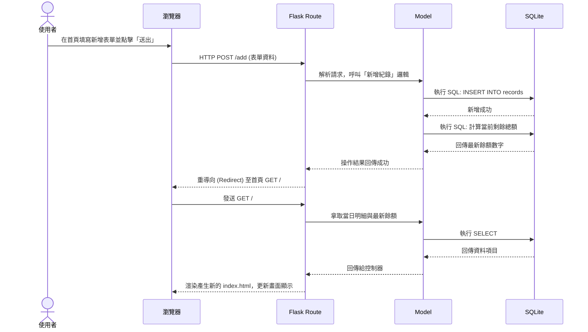

# 系統與使用者流程圖 (Flowcharts) - 個人記帳簿

本文件根據專案需求 (PRD.md) 與架構設計 (ARCHITECTURE.md)，以視覺化方式呈現使用者的操作路徑與系統內部的資料流動。

---

## 1. 使用者流程圖 (User Flow)

此流程圖描述使用者從開啟網站開始，能採取的各項操作路徑，包含新增收支、刪除紀錄、設定警示門檻以及查閱歷史明細。

```mermaid
flowchart LR
    A([使用者開啟網頁]) --> B[首頁 - 儀表板\n(顯示當日收支與餘額)]
    
    B --> C{要執行什麼操作？}
    
    C -->|新增收支| D[填寫收支表單\n(金額、類型、備註)]
    D -->|送出表單| E[系統更新紀錄與餘額]
    E --> B
    
    C -->|刪除錯誤紀錄| F[點擊刪除按鈕]
    F -->|顯示 JS 防呆確認對話框| G{確認刪除？}
    G -->|確認| H[系統刪除該筆紀錄定出以重新計算]
    H --> B
    G -->|取消| B
    
    C -->|查詢過往紀錄| I[切換至「歷史紀錄頁面」]
    I --> J[依照日期條件過濾]
    J --> I
    I -->|返回首頁| B
    
    C -->|設定警示門檻| K[切換至「設定頁面」]
    K --> L[輸入餘額底線並儲存]
    L --> B
```

---

## 2. 系統序列圖 (Sequence Diagram)

此圖以「使用者新增一筆收支紀錄」為例，展示前端瀏覽器、Flask Controller、Model 層與 SQLite 資料庫之間完整的請求處理流程與資料流動。



---

## 3. 功能清單與 API 對照表

以下整理了系統內提供的核心功能、觸發對應後端操作的 URL 路徑與 HTTP 方法。

| 功能名稱 | 說明 | HTTP 方法 | URL 路徑 |
| -- | -- | -- | -- |
| **檢視首頁 (Dashboard)** | 顯示當日所有收入、支出清單與目前的總餘額，低餘額警示觸發時會在這顯示。 | GET | `/` |
| **新增收支** | 接收表單傳遞的資料，寫入資料庫。完成後重新導向回首頁。 | POST | `/add` |
| **刪除紀錄** | 根據傳入的紀錄 ID 刪除特定資料（前端觸發前會先執行 JS 防呆檢查），完成後處理重新導向。 | POST | `/delete/<id>` |
| **檢視歷史紀錄** | 依據指定的日期條件查詢過往明細資料，可夾帶 Query 參數 `?date=YYYY-MM-DD` 進行篩選檢視。 | GET | `/history` |
| **檢視設定頁面** | 渲染並顯示當前「最低餘額門檻警示」的表單設定介面。 | GET | `/settings` |
| **更新底線設定** | 將使用者新設定的餘額底線數字更新至資料庫。成功後儲存狀態並導向回首頁。 | POST | `/settings` |

```
