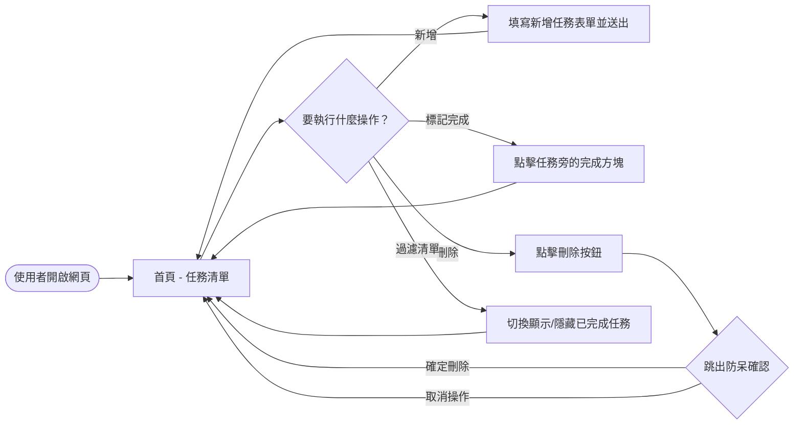
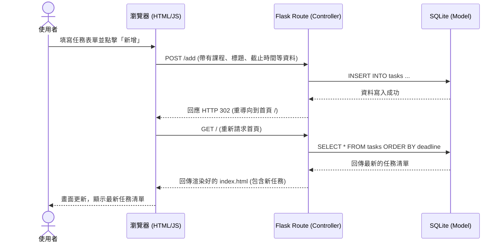

# 流程圖與系統流程設計 (FLOWCHART) - 作業提醒管理系統

根據產品需求文件 (PRD) 與系統架構文件 (ARCHITECTURE)，以下為本系統的使用者流程與系統互動序列圖。

## 1. 使用者流程圖（User Flow）

此流程圖描述使用者從進入網站開始，能夠執行的各項主要操作路徑，包含新增任務、標記完成、刪除任務以及過濾清單。

## 2. 系統序列圖（Sequence Diagram）

此序列圖描述當使用者執行「新增任務」時，資料如何在系統元件之間流動，從前端表單送出直到寫入資料庫並重新載入畫面的完整過程。

## 3. 功能清單對照表

本系統的核心功能對應的後端路由 (URL) 與 HTTP 請求方法規劃如下：

| 功能名稱 | URL 路徑 | HTTP 方法 | 說明 |
| --- | --- | --- | --- |
| 檢視首頁與任務清單 | `/` | GET | 取得並渲染所有任務的清單，包含新增表單的介面。 |
| 新增任務 | `/add` | POST | 接收表單傳來的任務資訊，寫入資料庫並重導回首頁。 |
| 切換完成狀態 | `/toggle/<int:task_id>` | POST | 根據指定的任務 ID，反轉其 `is_completed` 狀態。 |
| 刪除任務 | `/delete/<int:task_id>` | POST | 根據指定的任務 ID 將其從資料庫中刪除。 |
